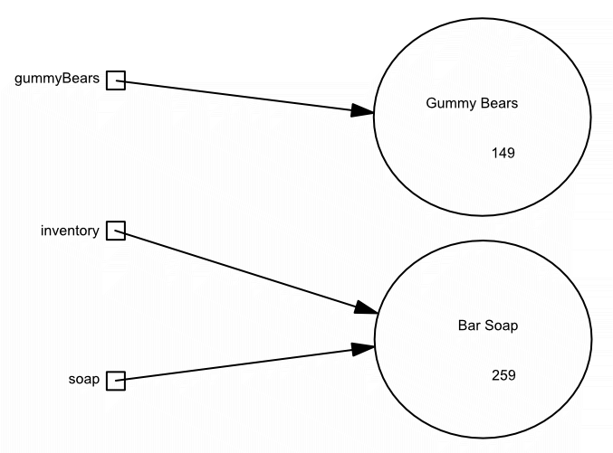
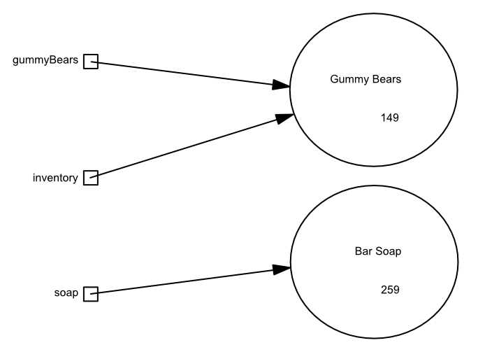
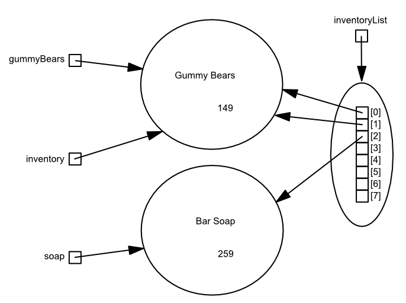

# Lab 1: Classes and Objects

## Step 1
Add code to the `main` method in the `Main` class so that you have two InventoryItem objects and three variables that 
reference those objects, as modelled by the following object diagram:


## Step 2
Add code to the same method so that 25 gummy bears are added to the gummy bear stock and 10 bar soaps are added to the 
bar soap stock.  Your code must then print out a description and number of items in stock for each of the objects 
referenced by your three variables.

Run the code and verify that you see something like:

```
Gummy Bears in stock: 25
Bar Soap in stock: 10
Bar Soap in stock: 10
```

Note that the order in which the output appears will depend on the order in which you work with each of your three 
variables.

## Step 3
Add code to the same method so that 15 gummy bears are added to the gummy bear stock.  Your code must then print out 
a description of the gummy bear inventory item and the number in stock.

Note that we've now added a total of 40 gummy bears to the gummy bear inventory.  However, our code prints 15 instead 
of 40.  Investigate the code in the InventoryItem class, find the bug (if you find more than one at this point, fix 
it!) and run your code again.  You should now see something like:

```
Gummy Bears in stock: 25
Bar Soap in stock: 10
Bar Soap in stock: 10
Gummy Bears in stock: 40
```

Commit and push your code to GitHub and request a grade from AutoTest by entering the following as a 
comment on your commit:

`@autobot #assign1`

If you fixed the bugs in the code correctly, you should receive a score of 100%.  Note that AutoTest is checking the 
implementation of the `InventoryItem` class *only*.  It is not checking that the code that
you've written in `Main` is correct.

## Step 4
Modify your code so that the relationship between your variables and your inventory objects is as depicted in the 
following diagram:


Now use the `inventory` variable to add 50 cents to the cost of the gummy bears.  You must do this by getting the 
current cost (so don't assume it's 149c) adding 50 cents to it and then setting the cost to the resulting value.

Your code must then print out a description and cost in cents for each of the objects referenced by your three variables.

Run the code and verify that you see something like:

```
Gummy Bears in stock: 25
Bar Soap in stock: 10
Bar Soap in stock: 10
Gummy Bears in stock: 40
Gummy Bears price: 199c
Bar Soap price: 259c
Gummy Bears price: 199c
```

Again, the order in which the output appears will depend on the order in which your work with your three variables.

## Step 5
Construct an `ArrayList` object and add the value of each of your three variables to the list, as modelled by the 
following object diagram:


## Step 6
Remove one gummy bear from the gummy bear inventory in 4 different ways.  

*Hint*: note that there are four references to the gummy bear inventory object in the diagram shown above  
- use each of them once!  

Then print out a description of the gummy bear inventory and the number of items left in stock.  
You should see something like the following:

```
Gummy Bears in stock: 25
Bar Soap in stock: 10
Bar Soap in stock: 10
Gummy Bears in stock: 40
Gummy Bears price: 199c
Bar Soap price: 259c
Gummy Bears price: 199c
Gummy Bears in stock: 36
```

If the number of gummy bears in stock is not correct after you've removed 4 items from inventory, 
there's one more bug in `InventoryItem` class that you must find and fix.

